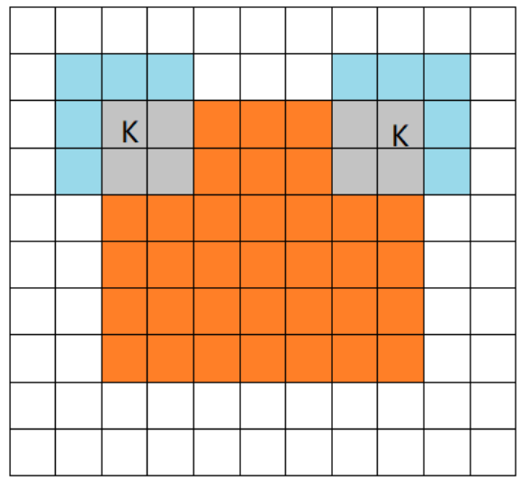
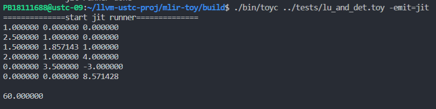

# Introduction to These Codes

by Hank Wang

---

## Files

核心文件树如下:
```tree
mlir-toy/
├── CMakeLists.txt
├── include
│   ├── CMakeLists.txt
│   └── toy
│       ├── AnalysisPass.h
│       ├── AST.h
│       ├── CMakeLists.txt
│       ├── Dialect.h
│       ├── Lexer.h
│       ├── MLIRGen.h
│       ├── Ops.td
│       ├── Parser.h
│       ├── Passes.h
│       ├── ShapeInferenceInterface.h
│       └── ShapeInferenceInterface.td
├── mlir
│   ├── Dialect.cpp
│   ├── LowerToAffineLoops.cpp
│   ├── LowerToGPU.cpp
│   ├── LowerToLLVM.cpp
│   ├── MLIRGen.cpp
│   ├── ShapeInferencePass.cpp
│   ├── ToyCombine.cpp
│   └── ToyCombine.td
├── parser
│   └── AST.cpp
├── toy-cuda-runner
├── toy-cuda-runner.cpp
└── toyc.cpp
```

其中, 
- `Ops.td`: 定义了一些 Operation, 参见[王章瀚的笔记](https://rabbitwhite1.github.io/posts/llvm/2021-1-23-MLIR_ODS.html)
- `ShapeInference*` 对应 [Chapter 4: Enabling Generic Transformation with Interfaces](https://mlir.llvm.org/docs/Tutorials/Toy/Ch-4/).
- `ToyCombine.*` 对应 [Chapter 3: High-level Language-Specific Analysis and Transformation](https://mlir.llvm.org/docs/Tutorials/Toy/Ch-3/)
- `Dialect.cpp` 定义了 Toy 语言的 dialect 相关信息.


## 增加算子

### 增加算子的步骤

#### 基于运算符增加算子

1. 修改 Lexer.h, Parser.h 和 MLIRGen.cpp 以支持相应的符号(如减号 `-`, 矩阵乘号 `@`)
2. 修改 Ops.td 增加相应操作, 如 `SubOp`, 此时其实就已经可以生成相应的头文件了.
3. 修改 Dialect.cpp 以实现一些操作. 此处有特殊定制的 `build`，`inferShape` 以及 `verify` 函数(`inferShape`用于形状推断, 是 `ShapeInference` 接口所要求实现的；`verify`用于判断输入输出的格式对错). 应当注意, 如果后面我们有什么其他的更新, 这些算子也都要进行相应的更新.
4. 在 LowerToAffineLoops.cpp 中对此 Op 进行 lowering. 
	1. 如果已经有相应的支持(`BinaryOpLowering`), 只需要实例化它就好
    	```cpp
    	using SubOpLowering = BinaryOpLowering<toy::SubOp, SubFOp>;
    	```
    	实例化后, 向 `ToyToAffineLoweringPass::runOnFunction()` 里的 `pattern` 添加此 Lowering(即 `SubOpLowering`)
	2. 如果没有相应的支持，则需要类似“基于内置函数增加算子”的模式，手写该部分代码
5. 编译
    如果在集群上编译需要运行
    ```shell
    cmake -G Ninja .. -DMLIR_DIR=/home/ustc/llvm-project-11.0.0/build/lib/cmake/mlir -DLLVM_DIR=/home/ustc/llvm-project-11.0.0/build/lib/cmake/llvm && cmake --build .
    ```
    我在自己电脑上编译了 MLIR 并安装好, 所以只需要:
    ```shell
    mkdir build && cd build
    cmake .. && make
6. 运行测试
    ```
    ./bin/toyc ../tests/subtract.toy -emit=mlir  # 生成 mlir
    ./bin/toyc ../tests/subtract.toy -emit=mlir-affine  # 生成 mlir 和 affine 的混合中间表示
    ./bin/toyc ../tests/subtract.toy -emit=mlir-llvm  # 生成 mlir 和 llvm 的混合中间表示
    ./bin/toyc ../tests/subtract.toy -emit=llvm  # 生成 llvm
    ./bin/toyc ../tests/subtract.toy -emit=jit  # 运行程序
    ```

#### 基于内置函数增加算子

1. 修改 MLIRGen.cpp 以支持相应的符号，相较于“基于运算符增加算子”，这里在 MLIRGen.cpp 中增加的是函数保留字
2. 修改 Ops.td 增加相应操作, 如 `MatrixMulOp`
3. 修改 Dialect.cpp 以实现一些操作. 此处有特殊定制的 `build`，`inferShape` 以及 `verify` 函数(`inferShape`用于形状推断, 是 `ShapeInference` 接口所要求实现的；`verify`用于判断输入输出的格式对错). 应当注意, 如果后面我们有什么其他的更新, 这些算子也都要进行相应的更新.
4. 在 LowerToAffineLoops.cpp 中对此 Op 进行 lowering. 该部分操作相对繁杂多变，以求行列式为例
	1. 该部分一般有固定的格式，如下:
	
		```cpp
		struct DetOpLowering : public ConversionPattern {
		  DetOpLowering(MLIRContext *ctx)
		      : ConversionPattern(toy::DetOp::getOperationName(), 1, ctx) {}
		
		  LogicalResult
		  matchAndRewrite(Operation *op, ArrayRef<Value> operands,
		                  ConversionPatternRewriter &rewriter) const final {

			···

			buildAffineLoopNest(···
			）{
			···
			}			

		    // Replace this operation with the generated alloc.
		    rewriter.replaceOp(op, alloc);
		    return success();
		  }
		};
		```	
   
5. 编译
    如果在集群上编译需要运行
    ```shell
    cmake -G Ninja .. -DMLIR_DIR=/home/ustc/llvm-project-11.0.0/build/lib/cmake/mlir -DLLVM_DIR=/home/ustc/llvm-project-11.0.0/build/lib/cmake/llvm && cmake --build .
    ```
    我在自己电脑上编译了 MLIR 并安装好, 所以只需要:
    ```shell
    mkdir build && cd build
    cmake .. && make
6. 运行测试
    ```
    ./bin/toyc ../tests/subtract.toy -emit=mlir  # 生成 mlir
    ./bin/toyc ../tests/subtract.toy -emit=mlir-affine  # 生成 mlir 和 affine 的混合中间表示
    ./bin/toyc ../tests/subtract.toy -emit=mlir-llvm  # 生成 mlir 和 llvm 的混合中间表示
    ./bin/toyc ../tests/subtract.toy -emit=llvm  # 生成 llvm
    ./bin/toyc ../tests/subtract.toy -emit=jit  # 运行程序
    ```

## 下推到 Affine

这里我们添加了一些算子，目前测试无误的有，
- 基本的二元运算如对应位置的加减乘除等。
- 矩阵乘法（内积）
    测试文件位于tests/matrixmul.toy, 通过`Matrixmul(a,b)`进行调用。

- 三种不同模式的卷积
    我们用图进行说明, 依次为full some和valid
    <center> 
        
    </center>
        通过`conv_full`，`conv_some`，`conv_valid`进行调用，可以在tests里看到测试文件。

- 矩阵LU分解与矩阵的行列式
  这部分的测试文件在tests/lu_and_det.toy中进行了测试，分别通过`lu()`和`det()`实现，结果如下。
    
    和python做的结果比较，验证结果是正确的。（本次测试没来得及展示行列式，您可以自己运行tests中的文件进行测试。
## 下推到 GPU

MLIR 提供了 GPU 相关的 Dialect, 通过把 toy 语言的 Dialect 下推到这个 GPU Dialect, 我们可以很方便的调用 CUDA 等 GPU 模型来运行我们的程序. 换句话说, 我们就可以直接让用 toy 语言编写的程序运行在 GPU 上.

这样做带来了很多优点：
1. 程序运行效率大大提升. 众所周知, GPU 的高并行性能使得深度学习等计算过程大大提速.
2. 提高程序开发效率. 类似 CUDA 或 OpenCL 的编程模型相对复杂, 需要领域特定的知识才能完成相应的编程. 但这里我们让 toy 语言经过我们的编译器, 能够直接得到一个可以运行在 GPU 上的代码, 这无疑是大大提高了开发人员的效率的.
3. ...

为了理解我们如何下推到 GPU Dialect, 我们首先有必要了解一下 CUDA 的编程模型, 因为 MLIR 的 GPU Dialect 很大程度上是和 CUDA 模型的概念一致的.

### CUDA 的编程模型

CUDA 里面有一个比较重要的概念: `kernel`, kernel 又对应了 GPU 设备上的一个 `grid`, 
- 每个 grid 有一组 blocks, 用 x, y, z 三个维度区分(图中为了方便只画了 2 个).
- 每个 block 又有一组 threads, 也是用 xyz 三个维度区分. 


用户在写 CUDA 相关代码的时候, 只需要写好函数 (如下示例代码中的 Plus), 然后在函数内引用 `block id` 和 `thread id` 就可以唯一确定一个线程, 这样一来就可以统一安排该线程内部需要做的事情. 
```c
__global__ void Plus(float A[], float B[], float C[], int n) {
    int i = blockDim.x * blockIdx.x + threadIdx.x;
    C[i] = A[i] + B[i];
}

int main()
{
    // 一些初始化与分配
    ...
    // 把 CPU 内存数据 copy 到 GPU 中
    ...
    // 定义kernel执行配置，（1024*1024/512）个block，每个block里面有512个线程
    dim3 dimBlock(512);
    dim3 dimGrid(1024 * 1024 / 512);
    // 执行kernel
    Plus<<<dimGrid, dimBlock>>>(A, B, C, n);
    // 把 GPU 内存中计算结果复制回 CPU 内存
    ...
    // 释放CPU端、GPU端的内存
    // free 和 cudaFree
}
```

- [ ] 王总 黄总 TODO
### 矩阵乘法
矩阵乘法的基本过程分为3步【假设Lhs(m\*n)和Rhs(n\*k)两个矩阵相乘AB】
1. 对所有$0<=x<=m$,$0<=y<=k$,$0<=r<=n$计算A[x,r]*B[r,y]的乘积(该计算给每个`thread`分配一个两个元素的乘法)
2. 对所有$0<=x<=m$,$0<=y<=k$,计算$sum_{0<=r<=n}^{Lhs[x,r]*Rhs[r,y]}$(可以使用`GPU dialect`自带的`AllReduce`操作,该操作对一个`block`内的所有元素进行某种二元运算操作,将二元运算操作设置为`add`即可对`block`内元素进行求和)
3. 将刚才的计算结果存入`Result`数组中对应的Result[x,y]位置即可

### 矩阵转置
矩阵转置的过程相比矩阵乘法更为简单，不需要GPU内部的运算操作，只需要将数据`Load`到GPU中再通过`Store`操作将(x,y)位置的数据相应存到(y,x)处即可。

## 自动微分畅想

本小组原计划在toy语言之中实现原生的自动微分，实现该操作有如下优势：

1. toy语言原生语法树，不同节点可以实现reserve-mode的自动微分
2. toy语言现有算符较少，实现自动微分较为简便
3. 自动微分技术较为成熟，网上有开源的版本库

不过因为该部分与 Dialect 关系不大，且最终依靠内置函数实现时，遇到了一定的技术问题，最主要的便是内置函数实现时，loop循环操作相对密封，很多for循环的操作不能移植，再加上工期不足的原因（不是），最后选择了放弃

