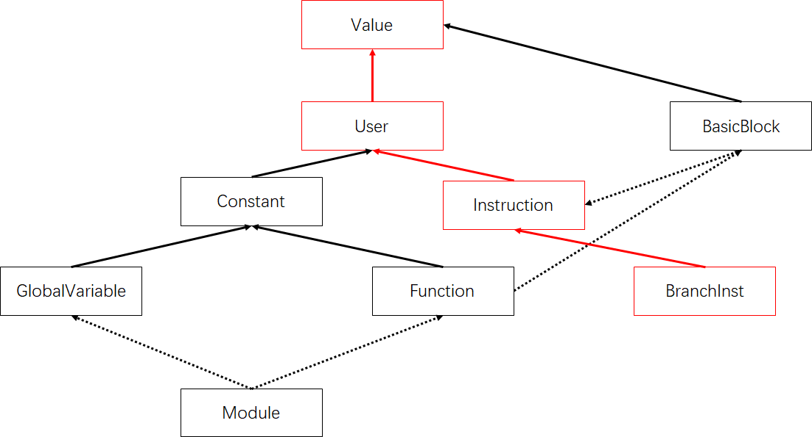

[TOC]

## 统计循环信息

### 0. 简介

本实训项目旨在引导学员学习和理解LLVM Pass开发的基本概念，学会运用LLVM的接口进行Pass模块开发。本项目主要开发一个循环访问的分析Pass，该Pass需要实现：统计循环信息，包括平行循环数量以及每个循环的深度信息

### 1. 基础知识

#### 控制流图

##### LLVM创建`Teminitor`语句，以`BranchInst`为例

LLVM IR层在创建时维护了控制流图(CFG)，下面从LLVM构建conditional branch指令为例，解释LLVM维护CFG的动作。如下面这一段代码是在创建一个函数，参考自[llvm/unittests](https://github.com/llvm/llvm-project/blob/62ec4ac90738a5f2d209ed28c822223e58aaaeb7/llvm/unittests/Analysis/MemorySSATest.cpp#L85):

```c++
IRBuilder<> B;
F = Function::Create(
      FunctionType::get(B.getVoidTy(), {B.getInt8PtrTy()}, false),
      GlobalValue::ExternalLinkage, "F", &M);	
BasicBlock *Entry(BasicBlock::Create(C, "", F));
BasicBlock *Left(BasicBlock::Create(C, "", F)); // Left BasicBlock表示true分支
BasicBlock *Right(BasicBlock::Create(C, "", F));// Right BasicBlock表示false分支
B.SetInsertPoint(Entry);						// 设置当前插入的基本块为Entry基本块
B.CreateCondBr(B.getTrue(), Left, Right);		// CreateCondBr表示构建条件跳转指令
...
```

其中，`Line 9`处调用了`IRBuilder`类的`CreateCondBr`的工厂方法构建了一个`BranchInst类`(`B.getTrue()`是返回一个恒真值)，这个方法的[定义](https://github.com/llvm/llvm-project/blob/62ec4ac90738a5f2d209ed28c822223e58aaaeb7/llvm/include/llvm/IR/IRBuilder.h#L988)如下：

```c++
BranchInst *CreateCondBr(Value *Cond, BasicBlock *True, BasicBlock *False,
                           Instruction *MDSrc) {
    BranchInst *Br = BranchInst::Create(True, False, Cond);
    if (MDSrc) {
        unsigned WL[4] = {LLVMContext::MD_prof, LLVMContext::MD_unpredictable,
                        LLVMContext::MD_make_implicit, LLVMContext::MD_dbg};
        Br->copyMetadata(*MDSrc, makeArrayRef(&WL[0], 4));
    }
    return Insert(Br);
}
```

可以看到`Line 5`调用了`BranchInst`类的`Create`方法构建了一个`BranchInst`类的实例，在`Line 9`处把这个实例化得到的对象插入到Entry块中。`Line3 Create`方法调用了`BranchInst`的[构造函数](https://github.com/llvm/llvm-project/blob/62ec4ac90738a5f2d209ed28c822223e58aaaeb7/llvm/include/llvm/IR/Instructions.h#L3075)，如下：

```c++
static BranchInst *Create(BasicBlock *IfTrue, BasicBlock *IfFalse,
                            Value *Cond, Instruction *InsertBefore = nullptr) {
    return new(3) BranchInst(IfTrue, IfFalse, Cond, InsertBefore);
}
```

注意这里的模板运算符`new`接收了一个非类型模板参数`3`，这个模板运算符是在`User`下被重载的，感兴趣的同学可以参考[llvm/IR/User.h](https://github.com/llvm/llvm-project/blob/62ec4ac90738a5f2d209ed28c822223e58aaaeb7/llvm/include/llvm/IR/User.h#L56)。这里，需要同学们对于LLVM的核心类有一个基本的认识，参考下图：



- 图中的**实线箭头**表示子类继承基类，**虚线箭头**表示容器与成员关系；
- **红色箭头**强调的是`BranchInst`的继承关系，作为`User`，`BranchInst`可以设置其操作数，操作数的数目由[llvm/IR/User.h](https://github.com/llvm/llvm-project/blob/62ec4ac90738a5f2d209ed28c822223e58aaaeb7/llvm/include/llvm/IR/User.h#L56)的`new`接收的非类型模板参数的值确定。

##### [CFG的建立，以BranchInst为例](https://github.com/llvm/llvm-project/blob/main/llvm/lib/IR/Instructions.cpp#L1209)

上一步骤最终调用了`BranchInst`的构造方法，如下：

```c++
BranchInst::BranchInst(BasicBlock *IfTrue, BasicBlock *IfFalse, Value *Cond,
                       Instruction *InsertBefore)
    : Instruction(Type::getVoidTy(IfTrue->getContext()), Instruction::Br,
                  OperandTraits<BranchInst>::op_end(this) - 3, 3,
                  InsertBefore) {
  Op<-1>() = IfTrue;		// 倒数第一个操作数设为IfTrue基本块
  Op<-2>() = IfFalse;		// 倒数第二个操作数设为IfFalse基本块
  Op<-3>() = Cond;			// 倒数第三个操作数设为条件语句
}
```

IfTrue和IfFalse是If语句的俩个分支，Op<-1>()和Op<-2>()的`=`(赋值)运算符被重载了，上述代码的第6、7行把IfTrue和IfFalse分支加入到了BranchInst* this的Use中，把BranchInst* this加入到了IfTrue和IfFalse分支的User中。通过访问Def-Use链可以访问CFG信息。

##### [后继基本块的访问](https://github.com/llvm/llvm-project/blob/62ec4ac90738a5f2d209ed28c822223e58aaaeb7/llvm/include/llvm/IR/CFG.h#L136)

```c++
template <class InstructionT, class BlockT>
class SuccIterator
    : public iterator_facade_base<SuccIterator<InstructionT, BlockT>,
                                  std::random_access_iterator_tag, BlockT, int,
                                  BlockT *, BlockT *> {
public:
  using difference_type = int;
  using pointer = BlockT *;
  using reference = BlockT *;

private:
  InstructionT *Inst;
  int Idx;
  using Self = SuccIterator<InstructionT, BlockT>;

  inline bool index_is_valid(int Idx) {
    // Note that we specially support the index of zero being valid even in the
    // face of a null instruction.
    return Idx >= 0 && (Idx == 0 || Idx <= (int)Inst->getNumSuccessors());
  }

  /// Proxy object to allow write access in operator[]
  class SuccessorProxy {
    Self It;

  public:
    explicit SuccessorProxy(const Self &It) : It(It) {}

    SuccessorProxy(const SuccessorProxy &) = default;

    SuccessorProxy &operator=(SuccessorProxy RHS) {
      *this = reference(RHS);
      return *this;
    }

    SuccessorProxy &operator=(reference RHS) {
      It.Inst->setSuccessor(It.Idx, RHS);
      return *this;
    }

    operator reference() const { return *It; }
  };

public:
  // begin iterator
  explicit inline SuccIterator(InstructionT *Inst) : Inst(Inst), Idx(0) {}
  // end iterator
  inline SuccIterator(InstructionT *Inst, bool) : Inst(Inst) {
    if (Inst)
      Idx = Inst->getNumSuccessors();
    else
      // Inst == NULL happens, if a basic block is not fully constructed and
      // consequently getTerminator() returns NULL. In this case we construct
      // a SuccIterator which describes a basic block that has zero
      // successors.
      // Defining SuccIterator for incomplete and malformed CFGs is especially
      // useful for debugging.
      Idx = 0;
  }

  /// This is used to interface between code that wants to
  /// operate on terminator instructions directly.
  int getSuccessorIndex() const { return Idx; }

  inline bool operator==(const Self &x) const { return Idx == x.Idx; }

  inline BlockT *operator*() const { return Inst->getSuccessor(Idx); }

  // We use the basic block pointer directly for operator->.
  inline BlockT *operator->() const { return operator*(); }

  inline bool operator<(const Self &RHS) const {
    assert(Inst == RHS.Inst && "Cannot compare iterators of different blocks!");
    return Idx < RHS.Idx;
  }

  int operator-(const Self &RHS) const {
    assert(Inst == RHS.Inst && "Cannot compare iterators of different blocks!");
    return Idx - RHS.Idx;
  }

  inline Self &operator+=(int RHS) {
    int NewIdx = Idx + RHS;
    assert(index_is_valid(NewIdx) && "Iterator index out of bound");
    Idx = NewIdx;
    return *this;
  }

  inline Self &operator-=(int RHS) { return operator+=(-RHS); }

  // Specially implement the [] operation using a proxy object to support
  // assignment.
  inline SuccessorProxy operator[](int Offset) {
    Self TmpIt = *this;
    TmpIt += Offset;
    return SuccessorProxy(TmpIt);
  }

  /// Get the source BlockT of this iterator.
  inline BlockT *getSource() {
    assert(Inst && "Source not available, if basic block was malformed");
    return Inst->getParent();
  }
};

using succ_iterator = SuccIterator<Instruction, BasicBlock>;
using const_succ_iterator = SuccIterator<const Instruction, const BasicBlock>;
using succ_range = iterator_range<succ_iterator>;
using const_succ_range = iterator_range<const_succ_iterator>;

inline succ_iterator succ_begin(Instruction *I) { return succ_iterator(I); }
inline const_succ_iterator succ_begin(const Instruction *I) {
  return const_succ_iterator(I);
}
inline succ_iterator succ_end(Instruction *I) { return succ_iterator(I, true); }
inline const_succ_iterator succ_end(const Instruction *I) {
  return const_succ_iterator(I, true);
}

inline succ_iterator succ_begin(BasicBlock *BB) {
  return succ_iterator(BB->getTerminator());
}
inline const_succ_iterator succ_begin(const BasicBlock *BB) {
  return const_succ_iterator(BB->getTerminator());
}
inline succ_iterator succ_end(BasicBlock *BB) {
  return succ_iterator(BB->getTerminator(), true);
}
inline const_succ_iterator succ_end(const BasicBlock *BB) {
  return const_succ_iterator(BB->getTerminator(), true);
}
```

根据上面的代码，可以通过<a name="succ_begin">`succ_begin`</a>方法获得前驱基本块的`begin`迭代器，这里的方法实例化了`succ_iterator`的对象。`succ_iterator`重载了`std::iterator`的运算符，需要注意的主要是：

- 取后继基本块的时候，实例化`succ_iterator`时传入参数是`BB->getTerminator()`，即BB的后继基本块信息保存在BB的终结语句上;
- 构造函数`succ_iterator(InstructionT *Inst) `把成员`Inst`置为`Inst`，把`Idx`置为0，表示从终结语句的第0个后继开始，依次取其后继；
- 构造函数`succ_iterator(InstructionT *Inst, bool) `把成员`Idx`置为`Inst`的后继的总数，表示取一个`Inst`的`Use_end()`；
- `*`取值运算符重载为调用`Inst->getSuccessor(Idx)`得到`Inst`的第`Idx`个后继。

如果要访问后继基本块，可以参考下面的示例代码，也可以参考`llvm/lib/Analysis/CFG.cpp`中的[回边查找算法](https://github.com/llvm/llvm-project/blob/62ec4ac90738a5f2d209ed28c822223e58aaaeb7/llvm/lib/Analysis/CFG.cpp#L34)：

```c++
void visitSucc(BasicBlock* BB){
	auto I = succ_begin(BB);
	while(I != succ_end(BB)){
		I++;
	}
}
```

##### [前驱基本块的访问](https://github.com/llvm/llvm-project/blob/62ec4ac90738a5f2d209ed28c822223e58aaaeb7/llvm/include/llvm/IR/CFG.h#L43)

```c++
template <class Ptr, class USE_iterator> // Predecessor Iterator
class PredIterator : public std::iterator<std::forward_iterator_tag,
                                          Ptr, ptrdiff_t, Ptr*, Ptr*> {
  using super =
      std::iterator<std::forward_iterator_tag, Ptr, ptrdiff_t, Ptr*, Ptr*>;
  using Self = PredIterator<Ptr, USE_iterator>;
  USE_iterator It;

  inline void advancePastNonTerminators() {
    // Loop to ignore non-terminator uses (for example BlockAddresses).
    while (!It.atEnd()) {
      if (auto *Inst = dyn_cast<Instruction>(*It))
        if (Inst->isTerminator())
          break;

      ++It;
    }
  }

public:
  using pointer = typename super::pointer;
  using reference = typename super::reference;

  PredIterator() = default;
  explicit inline PredIterator(Ptr *bb) : It(bb->user_begin()) {
    advancePastNonTerminators();
  }
  inline PredIterator(Ptr *bb, bool) : It(bb->user_end()) {}

  inline bool operator==(const Self& x) const { return It == x.It; }
  inline bool operator!=(const Self& x) const { return !operator==(x); }

  inline reference operator*() const {
    assert(!It.atEnd() && "pred_iterator out of range!");
    return cast<Instruction>(*It)->getParent();
  }
  inline pointer *operator->() const { return &operator*(); }

  inline Self& operator++() {   // Preincrement
    assert(!It.atEnd() && "pred_iterator out of range!");
    ++It; advancePastNonTerminators();
    return *this;
  }

  inline Self operator++(int) { // Postincrement
    Self tmp = *this; ++*this; return tmp;
  }

  /// getOperandNo - Return the operand number in the predecessor's
  /// terminator of the successor.
  unsigned getOperandNo() const {
    return It.getOperandNo();
  }

  /// getUse - Return the operand Use in the predecessor's terminator
  /// of the successor.
  Use &getUse() const {
    return It.getUse();
  }
};

using pred_iterator = PredIterator<BasicBlock, Value::user_iterator>;
using const_pred_iterator =
    PredIterator<const BasicBlock, Value::const_user_iterator>;
using pred_range = iterator_range<pred_iterator>;
using const_pred_range = iterator_range<const_pred_iterator>;

inline pred_iterator pred_begin(BasicBlock *BB) { return pred_iterator(BB); }
inline const_pred_iterator pred_begin(const BasicBlock *BB) {
  return const_pred_iterator(BB);
}
inline pred_iterator pred_end(BasicBlock *BB) { return pred_iterator(BB, true);}
```

根据上面的代码，可以通过`pred_begin`方法获得前驱基本块的`begin`迭代器，这里的方法实例化了`PredIterator`的对象。`PredIterator`重载了`std::iterator`的运算符，需要注意的主要是：

- 构造函数`PredIterator(Ptr *bb) `把成员`It`置为`bb`的`user_begin()`，`user_begin()`是第一个使用`bb`的[User](https://github.com/llvm/llvm-project/blob/main/llvm/include/llvm/IR/User.h#L44)，下同；
- 构造函数`PredIterator(Ptr *bb, bool) `把成员`It`置为`bb`的`user_end()`；
- `++`的前自增运算符调用`advancePastNonTerminators`方法跳过那些不是终结语句的`User`；
- `*`取值运算符重载为调用`cast<Instruction>(*It)->getParent()`得到`User`所在的基本块，即一个前驱基本块。

前驱基本块的访问和后继基本块的访问接口类似，主要使用`pred_begin`和`pred_end`方法。

#### 支配树

​	支配树算法描述详见 [支配树算法说明.pdf](./支配树算法说明.pdf)

##### 直接必经节点算法

1. 支配树建立函数伪代码说明 
   
     ​		支配树建立函数为`SemiNCA`函数，函数代码详见[https://github.com/xuweihf/llvm-project/blob/master/llvm/include/llvm/Support/GenericDomTreeConstruction.h](https://github.com/xuweihf/llvm-project/blob/master/llvm/include/llvm/Support/GenericDomTreeConstruction.h) Line  271~376。函数的伪代码说明如下。
   
   ~~~python
   runSemiNCA (&DT, MinLevel)
   	for(i : NextDFSNum){
           # 先将各个节点的IDOM设置为各节点的父亲
           Node[i].IDom = Node[i].Parent
       }
       
       # Step 1 计算各个节点的半支配节点
       for(i : NextDFSNum){
           Node[i].Semi = Node[i].Parent;
           
           for(N : Node[i]的前驱) {
           	if(Node[N].level < MinLevel)
           		continue
   
           	SemiU = Node[eval(N, i+1)].semi	# 计算节点N的semi
               
               # 查找节点i的半支配路径中最小的Semi值
               if (SemiU < Node[i].Semi)
               	Node[i].Semi = SemiU
           }
       }
       
       # Step 2 采用NCA方法，计算各个节点的直接支配节点
       for(i : NextDFSNum){
   		SDomNum = Node[i].Semi
           WIDomCandidate = Node[i].IDom	#初始为当前节点的父亲
           while (Node[WIDomCandidate].DFSNum > SDomNum)
           	WIDomCandidate = Node[WIDomCandidate].IDom
           
           Node[i].IDom = WIDomCandidate	
       }    
   ~~~
   
2. 查找半支配路径上最小Semi函数伪代码说明
   
   ​	查找半支配路径上最小Semi函数为`eval`函数，函数代码详见[https://github.com/xuweihf/llvm-project/blob/master/llvm/include/llvm/Support/GenericDomTreeConstruction.h](https://github.com/xuweihf/llvm-project/blob/master/llvm/include/llvm/Support/GenericDomTreeConstruction.h) Line 240~268。函数的伪代码说明如下。
   
   ~~~python
   runSemiNCA (V, LastLinked)
   	# 若节点V的序号小于当前查找节点序号，直接返回
       Info = Node[V]
   	if(Info->Parent < LastLinked)
       	return Node[V]->Label
       
       # Step 1 将以节点V结尾的半支配路径放入Stack中
       do {
         Stack.push_back(VInfo);
         VInfo = Node[VInfo->Parent];
       } while (VInfo->Parent >= LastLinked);
       
       # Step 2 进行路径压缩，同时查找本半支配路径上的最小semi值
       PInfo = VInfo
       PLabelInfo = Node[PInfo->Label];
       do {
         VInfo = Stack.pop_back()
         VInfo->Parent = PInfo->Parent	#路径压缩
         const InfoRec *VLabelInfo = Node[VInfo->Label]
         # 查找本半支配路径上的最小semi值
         if (PLabelInfo->Semi < VLabelInfo->Semi) 
           VInfo->Label = PInfo->Label
         else
           PLabelInfo = VLabelInfo
         PInfo = VInfo;
       } while (!Stack.empty())
       
       return VInfo->Label	
   ~~~

##### LLVM支配树的构造和访问

这里可以参考我们实现的代码中的[LSPass]()，这个Pass实现的是基于LLVM IR的CFG信息和支配树信息查找代码中存在的所有回边(BackEdge)，这代表了代码中存在的所有循环。算法如下：

```c++
bool runOnFunction(Function &F) override {
    size_t BackEdgeNum = 0;
    DominatorTree DT(F);
    PostDominatorTree PDT(F);
    std::vector<DomTreeNode*> WorkList;
    WorkList.push_back(DT.getRootNode());
    while(!WorkList.empty()){
      auto CurNode = WorkList.back();
      WorkList.pop_back();
      auto BB = CurNode->getBlock();
      for(auto sSucc = succ_begin(BB), eSucc = succ_end(BB);sSucc != eSucc; ++sSucc){
        auto SuccNode = DT.getNode(*sSucc);
        if(DT.dominates(SuccNode, CurNode)){
          BackEdgeNum++;
        }
      }
      WorkList.insert(WorkList.end(), CurNode->begin(), CurNode->end());
    }
    llvm::outs() << "Processing function " << F.getName() << ", number of Backedges is " << BackEdgeNum << "\n";
    return true;
  }
```

从上述代码，可以看到：

- 对于给定的`Function`，构造支配树非常简单，只需将`Function`指针作为参数传给`DominatorTree`或者`PostDominatorTree`的构造函数即可；

- 在支配树上，对当前所在的支配树节点，可以通过`getBlock`方法得到其表示的LLVM IR `BasicBlock`，可以通过`DominatorTreeBase::dominates`方法判断节点A是不是节点B的支配树上的祖先；

  > `DominatorTree`和`PostDominatorTree`类都是`DominatorTreeBase`的子类

- 这里还使用了前面提及的<a href="#succ_begin">succ_begin()</a>以及`succ_end`方法来使用迭代器遍历`BasicBlock`在LLVM IR CFG上的后继基本块。

##### 思考题（选做一题）

1. runSemiNCA函数Step 2计算NCA时，如何证明找到的 WIDomCandidate一定是Node[i].Semi和Node[i].Parent的最近共同祖先？
2. 阅读论文[A fast algorithm for finding dominators in a flowgraph](.\A fast algorithm for finding dominators in a flowgraph.pdf)，类似推导SemiNCA算法的算法复杂度
3. FindFunctionBackedges函数中InStack变量的物理意义可否给出解释（例如Visited变量的物理意义为存储已遍历的BB块集合、VisitStack变量的物理意义为栈中待处理的边集合）

### 2. 作业要求

基于driver，实现一个分析Pass，该Pass需要做到：

- 统计循环信息
  - 平行循环数量
  - 每个循环的深度信息

如对于给出的以下样例：

```c
int main(){
    int num = 0;
    for(int i=0;i<10;i++){
        for(int j=i;j<10;j++){
            for(int k=j;k<10;k++){
				num++;
            }
        }
        for(int j=i;j<10;j++){
            for(int k=j;k<10;k++){
				num++;
            }
        }
    }
    for(int i=0;i<10;i++){
        for(int j=i;j<10;j++){
            num++;
        }
    }
    return num;
}
```

你需要识别出main函数下有俩个平行循环，依次记为`L1`，`L2`; 其中，`L1`下又有俩个平行循环，依次记为`L11`，`L12`；`L11`下有一个嵌套深度为1的循环，记为`L111`;`L12`下有一个嵌套深度为1的循环，记为`L121`；`L2`下有一个嵌套深度为1的循环，记为`L21`。

因此你需要识别出如下的循环信息：

```json
{
    "L1" : {
        "depth" : 1,
        "L11" : {
            "depth" : 2,
            "L111" : {
                "depth" : 3
            }
        },
        "L12" : {
            "depth" : 2,
            "L121" : {
                "depth" : 3
            }
        }
    },
    "L2" : {
        "depth" : 1,
        "L21" : {
            "depth" : 2
        }
    }
}
```

> 这里，我使用了Json格式来显示我识别出的信息，同学们也可以选择自己习惯的其它表达格式。

