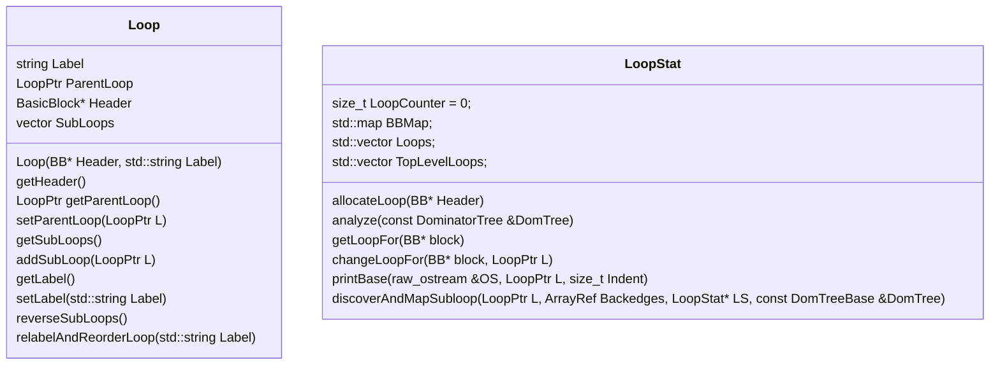
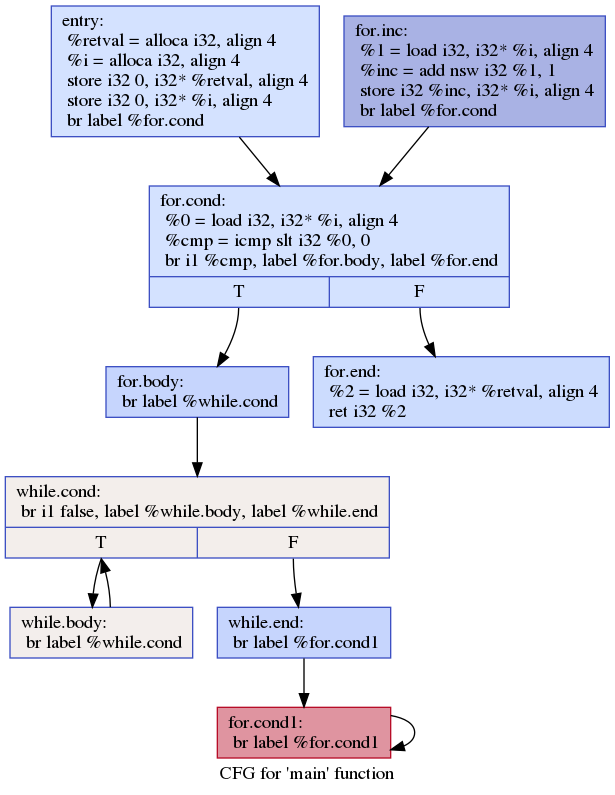

## 必做部分

#### 1.思考题
> 在runSemiNCA函数Step 2计算NCA时，如何证明找到的 WIDomCandidate一定是Node[i].Semi和Node[i].Parent的最近共同祖先？  
> ```c++
> # Step 2 采用NCA方法，计算各个节点的直接支配节点
> 1  for(i : [2,NextDFSNum-1] ){
> 2		SDomNum = Node[i].Semi
> 3       WIDomCandidate = Node[i].IDom	#初始为当前节点的父亲
> 4       while (Node[WIDomCandidate].DFSNum > SDomNum)
> 5       	WIDomCandidate = Node[WIDomCandidate].IDom       
> 6       Node[i].IDom = WIDomCandidate	
> 7   }  
>```

##### 预备引理

###### 引理1 
> Node[i].Semi.DFSNum < i.DFSNum

证明：`Node[i].Semi`是`Node[i]`的一个半必经路径的首点，由半必经路径定义，`Node[i].Semi.DFSNum < i.DFSNum`
###### 引理2 
> Node[i].iDom.DFSNum < Node[i].DFSNum
 
证明：由支配节点定义，从流图入口到达`Node[i]`的每条路径都会经过`Node[i].iDom`，因此在DFS先序遍历时，第一次到达`Node[i]`并编号前一定已经到达过`Node[i].iDom`并编号，因此`Node[i].iDom.DFSNum < Node[i].DFSNum`  
类似地，我们也可以用如下方式表述：
支配树上的任意一条边$x\rightarrow y$，有`x.DFSNum<y.DFSNum`
###### 引理3 
> Node[i].Parent.DFSNum $\geq$ Node[i].Semi.DFSNum
 
证明：由于在CFG图上，`i.Parent->i`也是一条半必经路径，其起点为`i.Parnet`，因此`i.semi`作为半必经路径DFSNum最小的首点，一定有`Node[i].Parent.DFSNum $\geq$ Node[i].Semi.DFSNum`。

##### 证明  
> TODO:好像有关于semi和sdom符号指代问题可能需要修改  

记`Node[i].Semi = u,Node[i].Parent=v`, 约定`u>v`表示`u.DFSNum`>`v.DFSNum`, 记$f(x)=x.iDom,f^{(n)}=f(f^{(n-1)})$证明如下:

###### 1. 若`WIDomCandidate==u`  

①当$u=v$时，显然有`WIDomCandidate`是两者在支配树上的最近共同祖先。  

②当$u\neq v$时，由`iDom`定义，有`Node[i].iDom`是`Node[i]`在支配树上的`parent`，此时`Node[i].iDom`<`Node[i]`的节点已经在支配树上构建。由于`v `> `u`，必然会至少进入line4的while循环一次，由于`WIDomCandidate`的初始值为`v`，则$u = f^{(n)}(v),(n\geq 1)$,对应支配树上一条路径$u= w_0 \rightarrow \cdots \rightarrow w_n = v$,因此u是v在支配树上的祖先，自然有u是u和v在支配树上的最近共同祖先。    

###### 2. 若`WIDomCandidate!=u`  

由情况1，此时在支配树上不存在从u到v的路径，由于支配树上任意非根节点都有根节点作为共同祖先，因此在支配树上必定存在u和v的共同祖先，记最近共同祖先为x，即支配树上存在路径1从x到u，路径2从x到v。  

下面用反证法证明路径2中不存在非x的小于u的节点。

记路径2为$x = w_0 \rightarrow \cdots \rightarrow w_n = v$,假设存在$w_i$, 有$w_i$<`u`，不妨设该节点为$w_1$，特别地，假设$w_1<u<w_2$。由于u和$w_1$在支配树上以x为根节点的子树的不同分支上，此时在CFG上存在不经过$w_1$的从x到u的路径3，同样地，CFG上存在不经过u的从$w_1$到$w_2$的路径4。

若路径4是DFS时先搜索到的路径，由定义有$w_2$<`u`，与假设矛盾，因此在实际DFS次序中，发现$w_1$后，先搜索的是其他路径，在这种情况下，$w_1$到$w_2$路径上的中间节点序号均大于$w_2$,因此$w_1$是$w_2$的一个半支配节点，所以$w_2$.semi < $w_1$。 同时由上面的分析，为了保证$w_1<u<w_2$至少还存在一条经过u的从$w_1$到$w_2$的路径5是DFS时第一次发现$w_2$时所走的路径。因此$w_2$.parent的直接支配节点一定为u或u在支配树中的祖先。  

由于`WIDomCandidate!=u`，因此`WIDomCandidate<u`因此在前一步构建支配树中的$w_2$时，由于$w_2$.semi  $\leq w_1$, $w_2$.parent $\leq$ `u`，由假设，存在直接路径$x\rightarrow u,x\rightarrow w_1$,因此`w2.WIDomCandidate` $\leq$ `WIDomCandidate(u,w1)`=x。因此$w_2$在支配树上的parent$\leq$x，与假设中$w_2$在支配树上从x到v的一条路径中不符，假设不成立。  

因此支配树上x到v的路径中不存在小于v的中间节点，因此最终退出while循环的`WIDomCandidate`一定为x，即u和v在支配树上的最近公共祖先。 


综上，计算NCA时找到的`WIDomCandidate`一定是`Node[i].Semi`和`Node[i].Parent`的最近共同祖先，证毕。

#### 2. 循环信息统计

循环信息统计能够帮助我们完成对 `循环` 这一非常常见的结构的优化, 本任务主要要求统计的是循环的深度, 且经咨询助教, 我们得知可以不考虑奇奇怪怪的 `goto` 用法, 因此我们可以

1. 采用[课本](#textbook)上描述的算法 9.7 `构造回边的自然循环` 的思路来寻找循环
2. 结合它由内向外地逐层搜索循环, 以获取循环及其父循环的关系.


##### 算法

首先描述一下课本上的算法, 即构造回边的自然循环:

这里引用书上的说法:
> 输入: 流图 G 和 回边 $n\rightarrow d$
> 输出: 由回边 $n\rightarrow d$ 确定的自然循环中所有结点的集合 loop.
> 方法: 令 loop 初值是 {n, d}. 标记 d 为已访问, 以保证搜索不会超出 d. 从结点 n 开始, 完成对流图 G 的逆向流图的深度优先搜索, 把搜索过程中访问的所有结点都加入 loop. 该过程找出不经过 d 能到达 n 的所有结点.

我们根据这个算法进行一定的**修改**才得到获取各循环深度的算法:
1. <a id='step1'></a>对支配树进行后序遍历. 在遍历每个结点的时候, 去遍历它在流图中的前驱, 通过 `dominates` 方法来判断支配情况, 以确认是否为回边. 
2. <a id='step234'></a>找到该结点相应的所有回边后, 就开始做在逆向流图的 DFS.
3. 在该 DFS 过程中, 若有未发现过的 `BasicBlock`, 就将其标记为当前循环的 `BasicBlock`; 否则它应当已经被之前的更内层的循环标记过, 我们不必理会(不把这个内层循环内的 `BasicBlock` 加入 DFS 的栈中), 只需继续 DFS.
4. 在前面完成了对整个支配树的后序遍历后, 我们就获得了每个 `BasicBlock` 所属的最近的一层循环, 以及各个循环的父循环. 那么此时只需要遍历一遍所有的循环, 就可以建立其循环嵌套的树.
5. <a id='step5'></a>一些简单的遍历树并 print

##### 代码结构

核心代码位于 [llvm-ustc-proj/my-llvm-driver/include/Analysis/LoopStatisticsPass.hpp](../include/Analysis/LoopStatisticsPass.hpp).

主要包含有



及一个函数
```cpp
discoverAndMapSubloop(LoopPtr L, ArrayRef<BB *> Backedges,
                           LoopStat* LS,
                           const DomTreeBase<BB> &DomTree) 
```

根据其名字很容易知道它们的作用, 这里就不过多解释了.

最核心的处理整个过程的是两个函数, 一个是 `LoopStat` 的  `analyze`, 一个是函数 `discoverAndMapSubloop`.
- `analyze` 函数就是前述用于后序遍历支配树的一个函数, 它会把找到的回边加入对应的 vector 中([步骤1](#step1)), 传给 `discoverAndMapSubloop`. 并在最后生成 循环嵌套树([步骤5](#step5))
- `discoverAndMapSubloop`: 用于发现当前 Loop 的子 Loop 并对相应 `BasicBlock` 设置所属最近循环.([步骤2, 3, 4](#step234))

##### 测试样例及结果解释

输出结果除了增加了一个函数名以外, 和助教给出的 `json` 无异.

- 跨函数的循环处理
  需要说明的是，这里不认为在一个函数的循环结构中调用了另一个含有循环的函数会增加嵌套的层数，实例代码参见`tests/loop3.cpp`，简写如下：
  ```c++
  void funLoop(){
    for(int i =0;i < 20;i++){
        ...
    }
  }
  int main(){
      for(int i=0;i < 10;i++)
          ...
          funLoop();
  }
  ```
  我们在实际分析时仍然按照对每个不同的函数单独生成循环统计信息的方式进行处理。即`funLoop`中仍然从第一层嵌套开始。





##### 参考资料

- <a id='textbook'></a>高等教育出版社的第 3 版编译原理(陈意云, 张昱著)
- LLVM 已有的 [LoopInfo](https://llvm.org/docs/LoopTerminology.html?highlight=loopinfo#loopinfo)
- [mermaid 类图画法](https://www.yzer.club/markdown-mermaid-class-diagram/)

